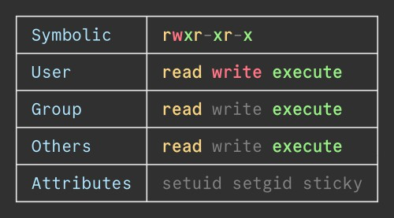

# perminfo
English | [日本語](README-ja.md)

perminfo is simple tool for displaying file permissions written in C.



## Installation
```sh
git clone https://github.com/qdz13/perminfo.git
cd perminfo
make
sudo make install
```
The colors can be changed by editing config.h.

## Usage
* Display permissions: `perminfo 755`
* Display file permissions: `perminfo example.txt`
* Display directory permissions: `perminfo /path/to/dir`
* Display help messages: `perminfo --help`
